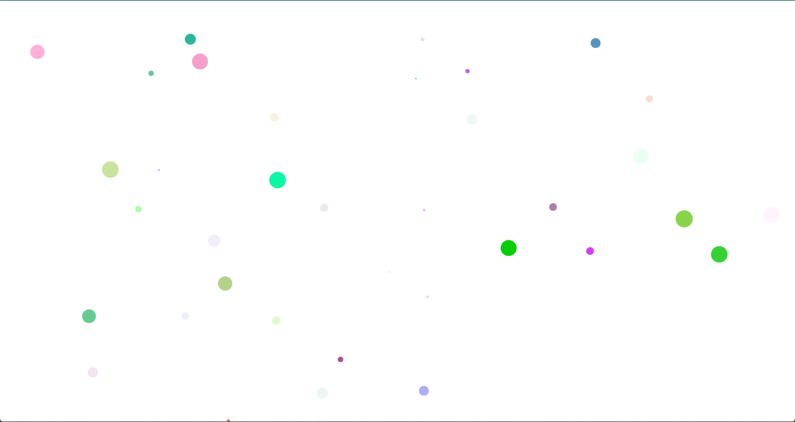
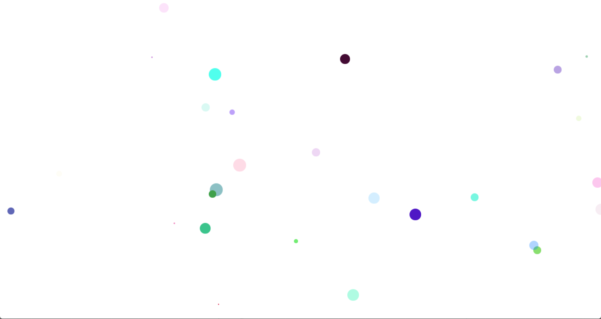

# Porticle.js

Minimalistic generation of random colourful particles that move (Can be used as a background) :stuck_out_tongue:


## Usage

Clone or Zip the repository, include the `porticle.js` in your html `header` along with the file `porticle.css`.
```
<script src="porticle.js"></script>
<link rel="stylesheet" href="porticle.css">
```

### Initialization
```
function porticle(numParts, numSize) {

}
```
- numParts : Number of bubbles
- numSize : maximum size of any bubble

####
```
<html>
  <head>
    <title>Porticle.js</title>
    <script src="porticle.js"></script>
    <link rel="stylesheet" href="porticle.css">
  </head>
  <body>
  </body>
  <script>
    var porticle = porticle(100, 30);
  </script>
</html>
```
### Screenshot
####

####

