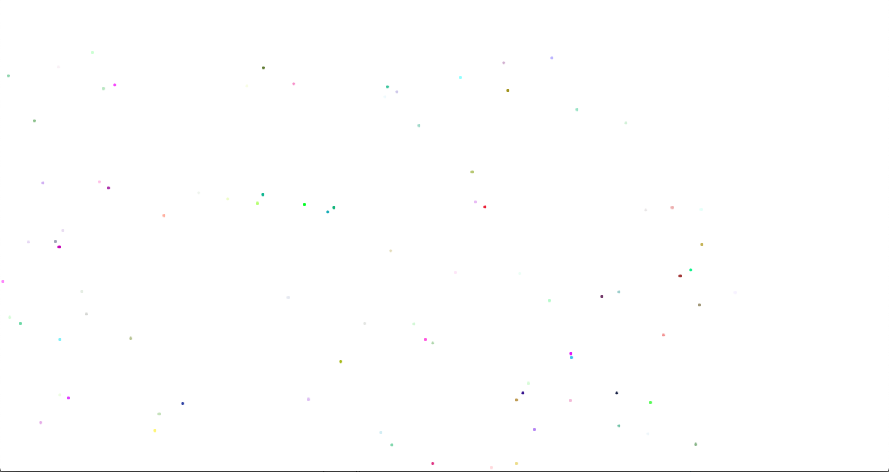

# Porticle.js

Minimalistic generation of random colourful particles that move (Can be used as a background) :stuck_out_tongue:


## Initialization
```
<html>
  <head>
    <title>Porticle.js</title>
    <script src="index.js"></script>
    <link rel="stylesheet" href="index.css">
  </head>
  <body>
  </body>
  <script>
    var porticle = porticle(100);
  </script>
</html>
```
## Screenshot
####

